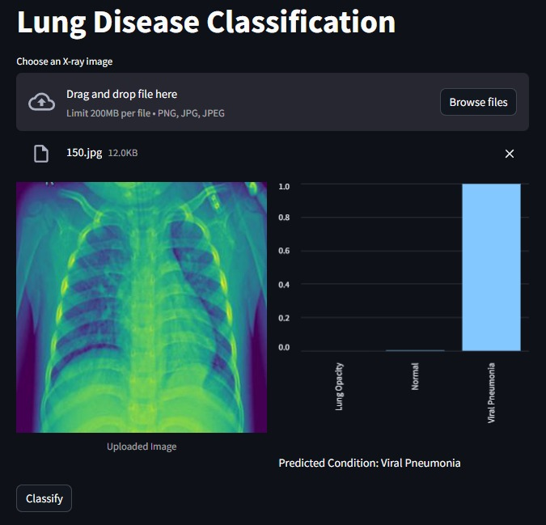
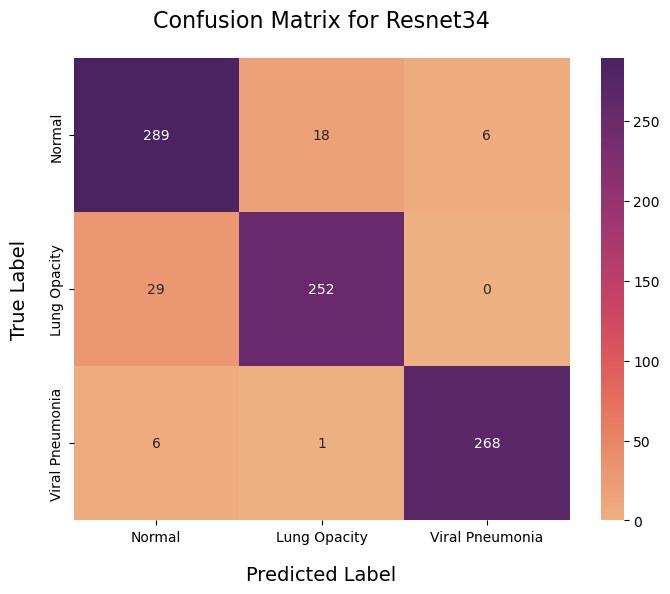

# Lung Disease Classification - Juarez Monteiro

## Overview
This project aims to develop a machine learning model for classifying lung diseases using chest X-ray images. Leveraging a dataset provided by Kaggle, the model seeks to identify and differentiate various pulmonary conditions to aid in medical diagnosis.

## Last Updates

### April

- **Model Implementation using TIMM**: integrated a model using the `timm` library, which is known for its comprehensive collection of pre-trained models and training scripts for deep learning.

- **Streamlit Interface Creation**: To enhance user interaction and accessibility, I've developed a new interface using Streamlit. To access the interface you just need to ```streamlit run app.py```: <br/><br/>
<div style="text-align: center;">
    
</div>


## Dataset
The dataset used is "Lung Disease" available on Kaggle, comprising chest X-ray images for identifying different lung diseases. Access the dataset directly [here](https://www.kaggle.com/datasets/fatemehmehrparvar/lung-disease).

## Methodology
The project utilizes advanced image processing techniques and machine learning algorithms to classify the images into specific disease categories. The process includes data pre-processing, model training, validation, and testing to ensure the model's accuracy and effectiveness.

## Tools and Technologies

### Programming Language:
- Python

### Libraries:
- **PyTorch:** Utilized for implementing and training deep learning models for image classification tasks.
- **NumPy:** Employed for numerical computations and array manipulations, essential for data preprocessing and model training.
- **Pandas:** Used for data manipulation and analysis, particularly for handling structured data such as CSV files containing image paths and labels.

### Data Visualization:
- **Matplotlib:** A versatile plotting library in Python used for creating visualizations such as bar charts, line plots, and histograms.
- **Seaborn:** Built on top of Matplotlib, Seaborn provides an enhanced interface for statistical data visualization, offering attractive and informative visualizations.

## Results

### Confusion Matrix


The confusion matrix provides a comprehensive overview of the model's performance by displaying the true positive, false positive, true negative, and false negative classifications across different lung disease categories.

### Correct Classifications


This visualization showcases the images that were correctly classified by the model, demonstrating its ability to accurately identify various pulmonary conditions.

### Misclassifications


In contrast to correct classifications, the misclassifications display instances where the model failed to accurately classify the chest X-ray images into the correct disease categories.

### Results Metrics


A summary of key performance metrics including accuracy, precision, recall, and F1-score, providing insights into the overall effectiveness of the trained models in classifying lung diseases.

### Training Loss


The training loss curve illustrates the progression of the model's loss function during the training process, indicating the convergence and stability of the model over epochs.

### Validation Loss


Similar to training loss, the validation loss curve depicts the model's loss function on the validation set, serving as a metric for evaluating the model's generalization capability.

### Validation Accuracy


The validation accuracy curve illustrates the accuracy of the model on the validation set across different epochs, providing insights into its performance over the training period.

**For more detailed analysis and results, please refer to the [results.ipynb](notebooks/results.ipynb) notebook.**

## How to Use
To set up the environment and run the project, follow these steps:

1. **Clone the repository:**
    ```
    git clone <repository_url>
    cd lung-disease-classification
    ```

2. **Create a Conda environment:**
    ```
    conda create --name lung-disease-env --file requirements.txt
    ```

3. **Activate the Conda environment:**
    ```
    conda activate lung-disease-env
    ```

4. **Run the project:** 
    - **Training:** Use the `train.sh` script located in the `scripts/` directory to train the models. Execute the following command:
        ```
        cd scripts/
       ./train.sh
        ```

    - **Testing:** After training, use the `test.sh` script located in the `scripts/` directory to test the trained models. Execute the following command:
        ```
        cd scripts/
        ./test.sh
        ```

5. **Analyze the Results:**
    - To analyze the results, navigate to the `notebooks/` directory and open the `results.ipynb` Jupyter notebook. This notebook provides an in-depth analysis of the model performance and visualizations of the results.


## Conclusion
This project demonstrates the practical application of machine learning and image processing techniques in the medical field, highlighting the importance and efficacy of these technologies in aiding the diagnosis of lung diseases.

## Contact
For inquiries or collaborations, feel free to reach out:

- **Email:** jrzmonteiro@gmail.com
- **LinkedIn:** [Juarez Monteiro](https://www.linkedin.com/in/juarez-monteiro/)
